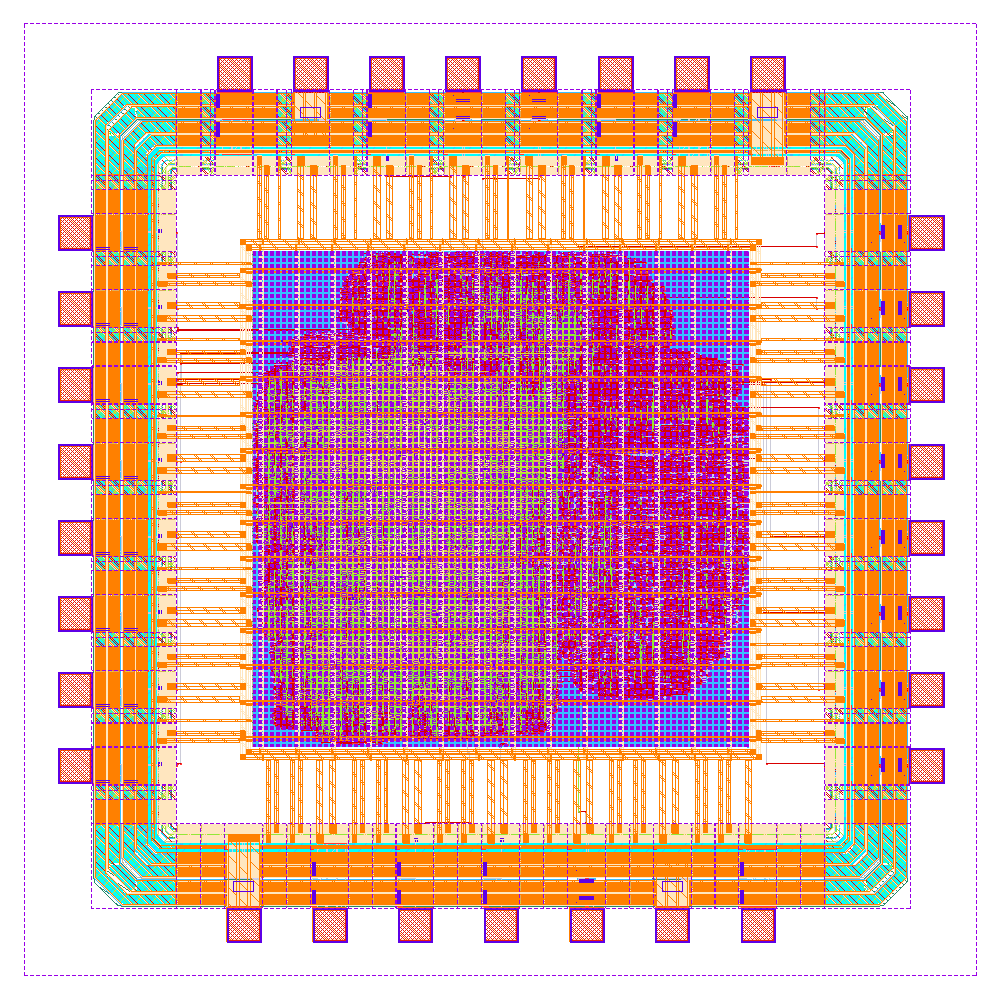

# NautilusQuant · NQX-S1

### Открытый чип сжатия KV-кэша: от идеи алгоритма до подписанной топологии 130 нм

*NQX-S1 под IHP SG13G2: 2,0 × 2,0 мм, 31 контактная площадка, 44 тыс. стандартных ячеек, 50 МГц.*

**[English](README.md)**

---

Большие языковые модели хранят для каждого токена ключи и значения
(KV-кэш), и на длинном контексте он занимает большую часть памяти. Лучшие
методы сжатия поворачивают каждый вектор случайной ортогональной матрицей
и затем квантуют. **NautilusQuant** проверяет, можно ли заменить случайную
матрицу константой: вращениями Гивенса с шагом угла, равным золотому углу
2π/φ². Тогда вращение детерминировано, и ему почти не нужна память.

Проект прошёл с этой идеей всю цепочку, как её проходит команда разработки
микросхем: бит-точная модель, синтезируемый RTL, симуляция и формальная
верификация, топология полного кристалла под реальную фабрику, подпись
(sign-off), пакет для производства и исследование, которое честно меряет,
где идея помогает, а где нет. Всё сделано на открытых инструментах и
открытых PDK.

## Чип

| | |
|---|---|
| Функция | Сжимает вектор KV из 128 × int16 в пакет 70 байт (вращение с золотым углом → полярная форма → 3 бита радиуса, 3 бита угла, биты уточнения) и обратно |
| Состояние вращения | Два 32-битных приращения фазы (`0x61C88647`, `0x9E3779B9`) и фазовый аккумулятор; нет ни таблицы углов, ни матрицы |
| Тракт | Один конвейерный CORDIC на 18 стадий (сдвиги и сложения) и для вращения, и для полярного преобразования; умножителей общего назначения нет |
| Интерфейс | 8 бит на вход и на выход, асинхронное четырёхфазное рукопожатие, подключается к любому микроконтроллеру |
| Техпроцесс | IHP SG13G2 130 нм: кристалл 2,0 × 2,0 мм, ядро 1,04 мм, заполнение 63 %, 5 634 триггера, 50 МГц, 4,6 мВт |
| Подпись | DRC в KLayout по полному набору правил IHP (174 категории): 0 · плотность металла и антенны: 0 · LVS: схемы совпадают · STA на трёх углах: запас +1,08 нс при 1,08 В / 125 °C, нарушений по фронтам и ёмкостям нет |
| Верификация | Бит-в-бит с моделью на Python: блок CORDIC (4 254 операции), ядро (случайные программы, задержки шины), выводы чипа (91 эталонная транзакция) и нетлист после трассировки; доказательства SymbiYosys для рукопожатия и протокола потока |
| Второй техпроцесс | wafer.space GF180MCU: CI собирает два размера кристалла, гоняет симуляцию на уровне вентилей и проходит официальную проверку wafer.space |
| Статус | Пакет для фабрики готов ([`nqx-silicon/tapeout/ihp-sg13g2/`](nqx-silicon/tapeout/ihp-sg13g2/)); кремний не заказан |

Подробный обзор чипа по-русски: [`nqx-silicon/README.ru.md`](nqx-silicon/README.ru.md).
Спецификация из 12 документов: [`nqx-silicon/spec/`](nqx-silicon/spec/).

## Что сделано

| Этап | Результат | Где |
|---|---|---|
| Алгоритм | Вращение Гивенса с золотым углом и полярный квантователь; версия 1 на PyTorch и Triton | [`reference/`](reference/) |
| Эмулятор | Потактовый эмулятор идеализированного ускорителя на NumPy, система команд из 24 кодов, ассемблер, SDK, 247 тестов | [`nqx-core/`](nqx-core/) |
| Бит-точная модель | Модель в фиксированной точке, с которой RTL обязан совпадать бит в бит; единый источник констант для заголовков RTL | [`nqx-silicon/model/`](nqx-silicon/model/) |
| RTL | 10 модулей на SystemVerilog: конвейерный CORDIC, кодеры радиуса и угла, 28-битный делитель, регистровый файл 2R2W, асинхронный байтовый интерфейс; без предупреждений в Verilator, Yosys и Icarus | [`nqx-silicon/rtl/`](nqx-silicon/rtl/) |
| Верификация | Регрессии cocotb, доказательства SymbiYosys (k-индукция), эталонные векторы для запуска кремния, симуляция на уровне вентилей с моделями ячеек фабрики | [`nqx-silicon/verif/`](nqx-silicon/verif/) |
| Физический дизайн | Маршрут LibreLane Chip: кольцо контактных площадок, питание, размещение, дерево тактов, трассировка, seal ring, заполнение металлом | [`nqx-silicon/flow/ihp-sg13g2/`](nqx-silicon/flow/ihp-sg13g2/) |
| Подпись | DRC, плотность, антенны, LVS, статический анализ времени на трёх углах, падение напряжения | [`spec/06_physical_design.md`](nqx-silicon/spec/06_physical_design.md) |
| Второй техпроцесс | Перенос на шаблон wafer.space GF180MCU со сборкой и проверкой в CI | [`nqx-silicon/flow/wafer-space-gf180/`](nqx-silicon/flow/wafer-space-gf180/) |
| Tiny Tapeout | Уменьшенная версия на 32 значения, упакованная под плитку Tiny Tapeout | [`nqx-silicon/tinytapeout/`](nqx-silicon/tinytapeout/) |
| Запуск кремния | Драйвер на MicroPython для Raspberry Pi Pico и прогон тестовых векторов | [`nqx-silicon/host/`](nqx-silicon/host/) |
| Исследование | Обратный анализ против открытых методов сжатия KV, кодек NQX-RN, препринт из трёх частей | [`nqx-silicon/research/`](nqx-silicon/research/), [`nqx-silicon/paper/`](nqx-silicon/paper/) |
| CI | GitHub Actions: модель, lint, формальная проверка, RTL и эталонные векторы на каждый push; полная сборка GDSII по запросу | [`.github/workflows/`](.github/workflows/) |

## Какие проблемы подписи пришлось решить

| Проблема | Причина | Решение | Было → стало |
|---|---|---|---|
| Запас по setup на медленном углу (1,08 В, 125 °C) | Оптимизатор оценивал паразитные ёмкости по размещению и смотрел только типичный угол | Ремонт после глобальной трассировки, проверка всех углов | −2,5 нс → +1,08 нс |
| Антенные диоды почти на каждой цепи | Эвристическая вставка диодов | Отключена; антенны чинятся после трассировки и проверяются правилами IHP | 47 343 диода → 0 |
| Буферы hold | Неопределённость такта для setup применялась и к hold | Отдельный запас hold 0,10 нс | 7 254 → 731 буфер |
| Заполнение металлом падало по памяти | Скрипт PDK разворачивает кристалл в плоскую геометрию | Те же правила в иерархическом режиме KLayout | > 12 ГБ → 2 ГБ |
| Плотность Metal2 ниже 25 % в окнах 800 мкм | Ядро целиком занято трассированными ячейками | Ядро меньше, шаг заполнения отдельно по слоям | 16–22 % → правило выполнено во всех окнах |
| 13 несовпавших цепей в LVS | Контактные площадки стояли встык к выводу пэда, контакт не извлекался | Нахлёст 1 мкм на металл пэда | 13 → 0 |
| Эталонный LVS IHP для KLayout неприменим | Не принимает схемы ячеек ввода-вывода из того же PDK | Извлечение в Magic + Netgen, ячейки ввода-вывода как абстракты | схемы совпадают |

## Результаты исследования

Отрицательные результаты в исследовании описаны наравне с положительными.

1. **Золотой угол не лучше случайного вращения.** В версии 1 он проиграл
   7,9 % по ошибке восстановления. Реальные его свойства — детерминизм и
   крошечное состояние: 1,9 КБ таблицы углов вместо матрицы 32 КБ, а на чипе
   два 32-битных регистра.
2. **Перевод в фиксированную точку вскрыл структуру.** Третий слой вращения
   тождественен, углы второго равны углам первого с обратным знаком. Новый
   квантователь снизил ошибку восстановления с 0,316 до 0,146 при тех же
   4 битах на значение.
3. **Почему золотой угол проигрывает.** Вращение по соседним парам
   распределяет каждый канал всего на 4 выхода из 128. Топология «бабочка»
   с золотыми углами сравнивается с Адамаром и случайным вращением без
   единого умножителя.
4. **Главное преимущество — бит-точность.** При переходе float-вращения с
   fp32 на bf16 у 73 % векторов меняется хотя бы один код; у целочисленного
   CORDIC — ни одного.
5. **Подстройка углов под данные не переносится.** Настройка под каждую
   голову снизила ошибку на данных настройки на 36 %, а на новых токенах той
   же головы изменила её на +1 %.
6. **NQX-RN — кодек, который совпадает со структурой данных.** Ключи
   хранятся до RoPE, каждая RoPE-пара — радиусом и углом; RoPE становится
   сложением целой фазы, биты распределяются по энергии запроса. На
   эмуляторе KV-кэша при 3,1 бита на значение ошибка внимания 0,263 —
   меньше, чем у Адамара и случайного вращения при 4,1 бита (0,297 и 0,316).
   Выигрыш пропадает без массивных значений в ключах и при сдвиге
   калибровки на 40 %; **на настоящей модели ещё не проверен**.

Полный текст — препринт из трёх частей:
[`nqx-silicon/paper/nautilusquant_v1_v2.ru.md`](nqx-silicon/paper/nautilusquant_v1_v2.ru.md).

## Структура репозитория

| Путь | Содержимое |
|---|---|
| [`nqx-silicon/`](nqx-silicon/) | **Чип NQX-S1**: модель, RTL, верификация, маршруты IHP и GF180, пакет для фабрики, спецификация, исследования, препринт |
| [`nqx-core/`](nqx-core/) | Версия 1: эмулятор ускорителя, система команд, SDK, сервер, 247 тестов |
| [`reference/`](reference/) | Версия 1: эталонный код на PyTorch и Triton, бенчмарки |
| [`labs/`](labs/) | Интерактивные визуализации для браузера |
| [`docs/`](docs/) | Ранние проектные заметки и README версии 1 |

## Инструменты

Python и NumPy · SystemVerilog · Verilator · Icarus Verilog · Yosys ·
cocotb · SymbiYosys · LibreLane (OpenROAD, OpenSTA, Magic, Netgen, KLayout) ·
IHP-Open-PDK SG13G2 · GF180MCU · GitHub Actions · Nix

Лицензия MIT. Аппаратная реализация, верификация и физический дизайн
версии 2 выполнены с помощью Claude Code (Anthropic).
